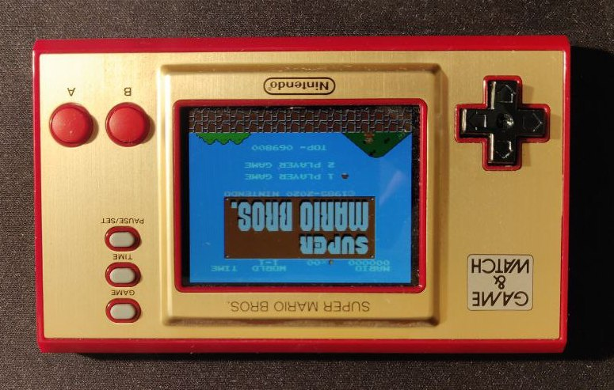
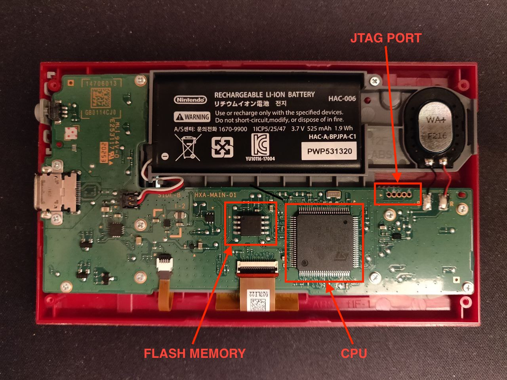
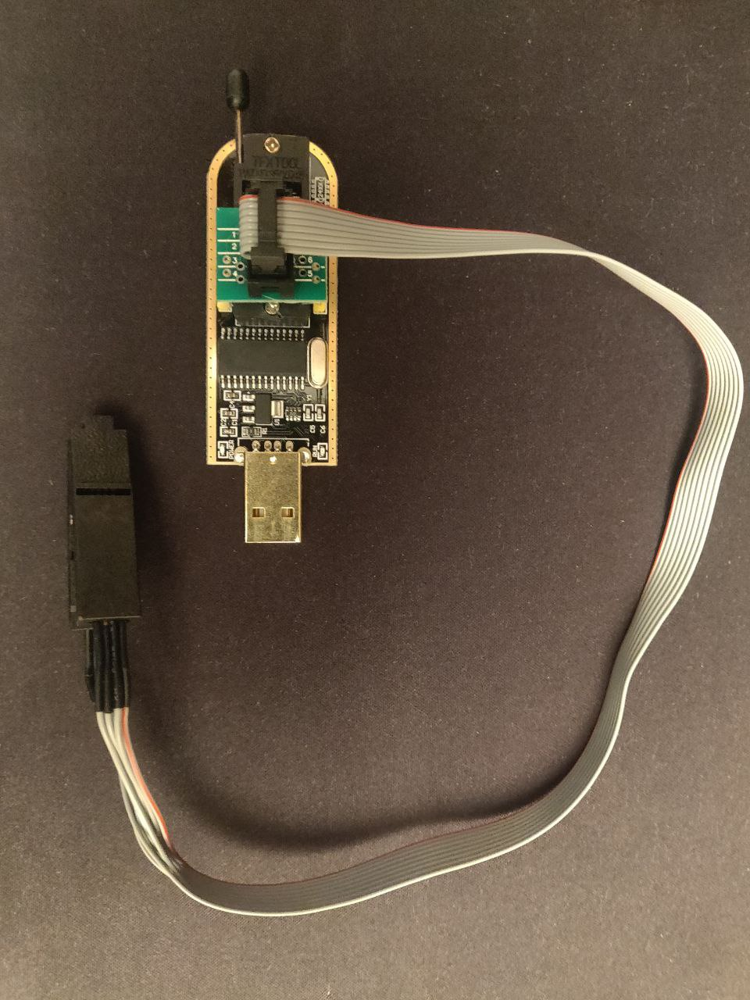
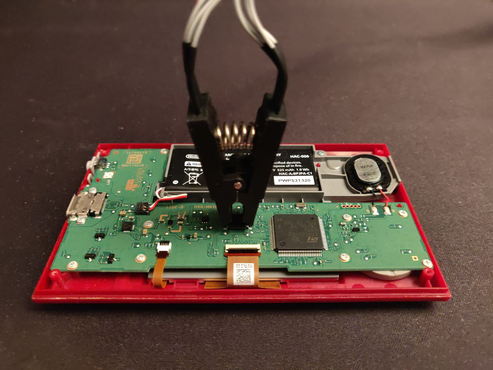
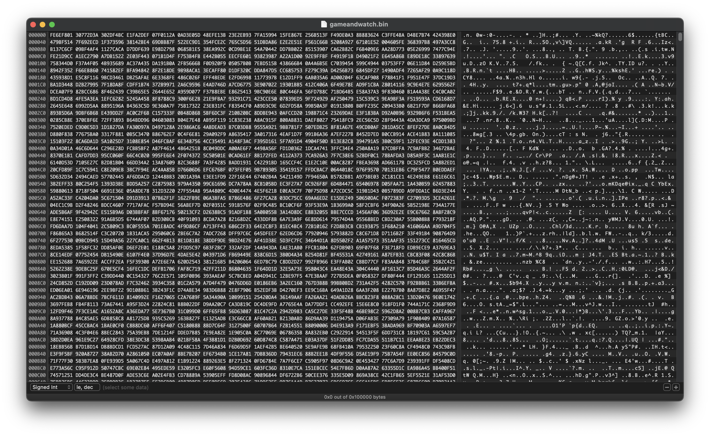
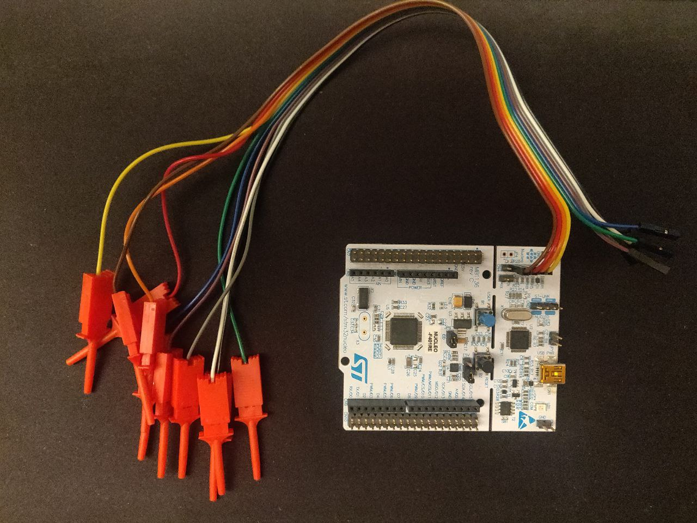
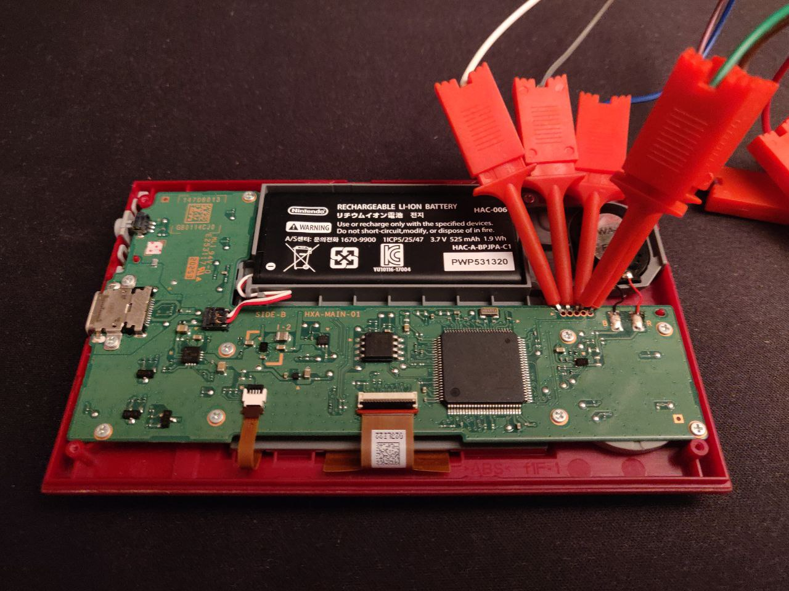
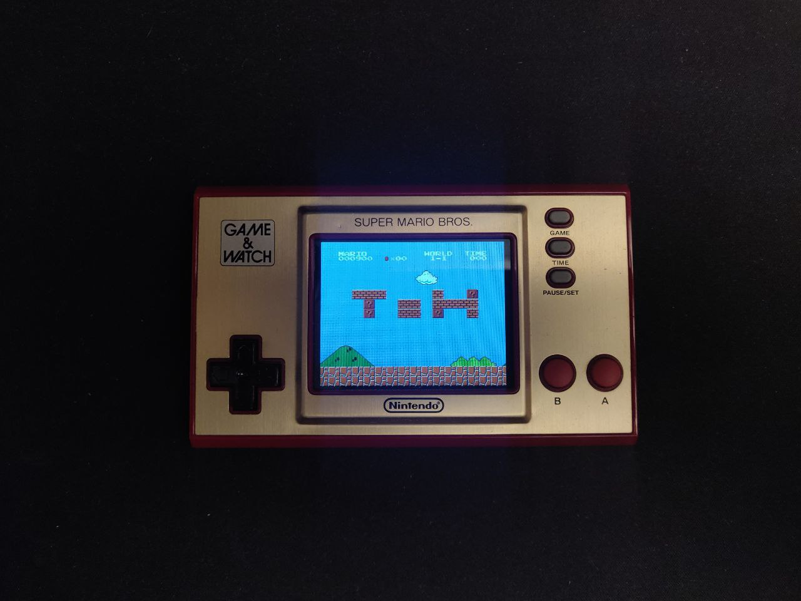

## Hacking the Nintendo Game & Watch 

The Game & Watch: Super Mario Bros was published by Nintendo for the 35° 
anniversary of Super Mario Bros. This console is a remaking of the original 
Game & Watch, the first portable console by Nintendo, produced in 1980.

This new version of the console contains:
- Super Mario Bros
- Super Mario Bros: The Lost Levels
- Ball (Mario version)
- A digital clock



Our goal is to develop a methodology for modifying the levels of 
Super Mario Bros by adding, removing or moving obstacles and enemies 
according to our liking. In order to achieve this, we need to go through 
the following steps:
- dump the content of the flash memory 
- locate in the dumped raw bytes those of the game
- reverse engineer the game to figure out which bytes refer to the description of the different levels
- mod the level according to our will
- rewrite the modified memory to the flash

First of all we have to open the device and figure out all components on the motherboard:



Now that we have located the flash memory we can dump its content via a Flash Chip
USB Programmer by attaching the Test Clip to the memory on the device and the USB to our laptop.

 

Then, we run in our terminal the following command:
```bash
flashrom --programmer ch341a_spi -r gameandwatch.bin
```

Now we have on our desktop a file, called gameandwatch.bin, with the content 
of the flash memory that we can open with any binary editor.



The first thing we notice as soon as we open the file in the binary editor 
is that its content is encrypted. We can confirm this assumption by calculating 
the entropy on the file.  
Fortunately, the encryption system used by Nintendo is simple: a stream cipher 
based on an xor operation with a key.

Even if the cipher used is simple we have to find a way to identify the key used by Nintendo.  
The most direct approach is to take advantage of the fact that in order to work, the Game & Watch 
must decrypt the contents of its flash memory and transfer the plain instructions into the RAM
so that the CPU can execute them. We can access the contents of the RAM while the device is turned 
on via the JTAG port on the motherboard. 



We connect the ST-LINK device to the exposed pins and then we run a debugger through the following command:
```bash
openocd -f interface/stlink.cfg -c "transport select hla_swd" -f target/stm32h7x.cfg
```
Now that we have a debugger on the device we can simply dump the RAM with the command:
```bash
dump_image ./ram.bin 0x24000000 0x40000
```
Finally, we can exploit the plain version of the flash memory in ram.bin and xor it with the 
encrypted one in gameandwatch.bin to obtain the key. It is important for us to 
have the key because it will be essential to re-encrypt the modified version of 
the memory before re-writing it on the device. 

The next step is to locate in the plain flash memory the instructions related to
Super Mario Bros. This task is straightforward, we just need to search the 
flash memory for the bytes of the original Super Mario Bros ROM for the NES, 
which is easily found online.  
We begins a laborious and tedious try and error by changing the bytes and writing it 
back to the device until we notice a change in the position of some objects in the level.
When this happens, on the basis of which object has moved, we can identify which opcodes 
identify the different objects and which their positions.  
At this point we can finally have fun modifying the memory by moving objects,
such as the blocks that characterize a level, so as to create our version of the game.  
After crafting our version of the game we simply re-encrypt the memory via xor with the key 
and write it on the device by connecting the USB Flash Chip Programmer and running the command:
```bash
flashrom --programmer ch341a_spi -w modified_flash.bin
```



In the above image I report my modified version of the first level of the game in which I move the 
blocks so as to form the writing ToH, which is the acronym of the CTF 
Tower of Hanoi team of the Politecnico di Milano.


